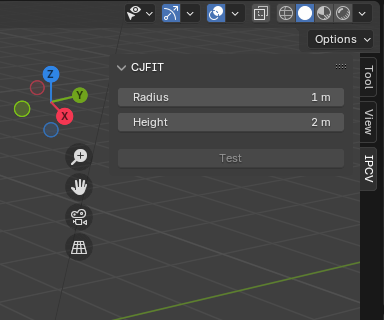
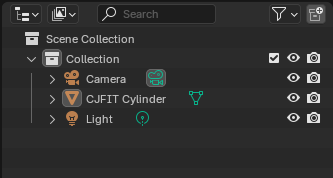
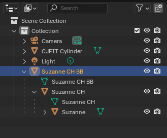
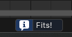
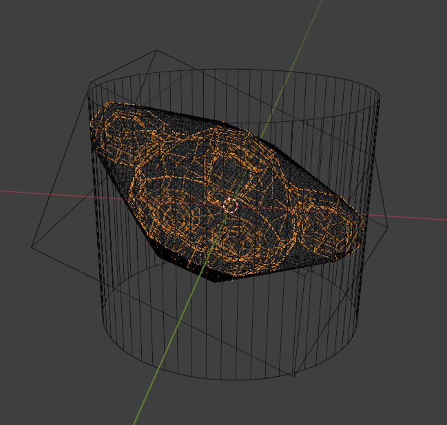
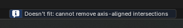

# CJFIT: Cylindrical Jig Fit Test

Implementation of the [CJFIT algorithm](doc/CJFIT.pdf) as a Blender Add-on.

The current implementation uses iterative roto-translation with fixed step size to remove intersections.

## Install

**Requires Blender >= 4.2**
\
\
Normal procedure for installing an extension from disk.
\
From within Blender: Edit -> Preferences -> Get Extensions -> (top right 
dropdown arrow) -> Install from disk -> (select the release zip for your os)

## Usage

Once installed you will see the extension's panel in the Sidebar of the 3D Viewport:

You can adjust the cylinder's radius and height. 
\
A cylinder is created in the viewport to visualize the changes in real time. 
\
You can hide/delete the cylinder from the Outliner:

When a Mesh object is selected and active, the Test button activates.
\
Clicking Test, well, initiates the test.
\
The test is blocking because, as of now, it runs on the draw thread.
\
You will, however, visualize the rotation/adjustments of the object in realtime, as the algorithm tries to solve the problem.
\
\
When the test finishes, the original object will be parented to its convex hull, parented to its bounding box:

A notification will appear with the test result:

The object will be in the solving orientation and position:

Or in case of a negative outcome, like:

the object will be in the last orientation and position where the algorithm concluded the object does not fit.

## Build from source

`blender --command extension build --split-platforms --source-dir src --output-dir ../build`

